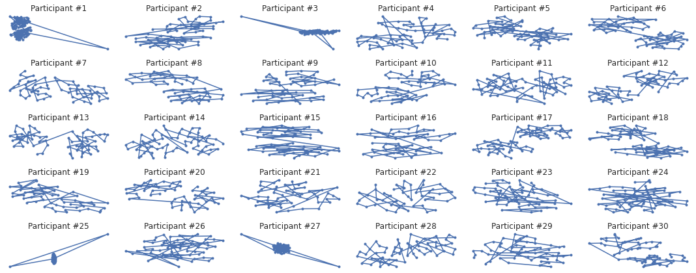

# Human-Activity-Recognition-Using-Neural-Networks
## To recognize and analyse daily human activities

**Author** : SHAILESH DHAMA

The Human Activity Recognition database was built from the recordings of 30 study participants performing activities of daily living (ADL) while carrying a waist-mounted smartphone with embedded inertial sensors. The objective is to classify activities into one of the six activities performed.

## Objective:

Develop an algorithm which will identify the artist when provided with a painting, with state of the art precision.

### Dataset:

The experiments have been carried out with a group of 30 volunteers within an age bracket of 19-48 years. Each person performed six activities (WALKING, WALKINGUPSTAIRS, WALKINGDOWNSTAIRS, SITTING, STANDING, LAYING) wearing a smartphone (Samsung Galaxy S II) on the waist. Using its embedded accelerometer and gyroscope, we captured 3-axial linear acceleration and 3-axial angular velocity at a constant rate of 50Hz. The experiments have been video-recorded to label the data manually. The obtained dataset has been randomly partitioned into two sets, where 70% of the volunteers was selected for generating the training data and 30% the test data.

The sensor signals (accelerometer and gyroscope) were pre-processed by applying noise filters and then sampled in fixed-width sliding windows of 2.56 sec and 50% overlap (128 readings/window). The sensor acceleration signal, which has gravitational and body motion components, was separated using a Butterworth low-pass filter into body acceleration and gravity. The gravitational force is assumed to have only low frequency components, therefore a filter with 0.3 Hz cutoff frequency was used. From each window, a vector of features was obtained by calculating variables from the time and frequency domain.
    
## Approach:

### Data processing & Visualisation:

    1.Import Libraries
    2.Load Data
    3.Dataset Exploration
    4.Distribution of Labels
    5.TSNE: Participant Visualisation
    6.Visualizations for feature distributions

### Modelling and Training:

    1.Feature Scaling
    2.Artificial Neural Network.
           
## RESULTS :

#### Smartphone Activity Label Distribution


#### TSNE: Activity Visualisation


#### Feature distributions


#### Feature distributions for every activity


#### Sensor Importance For Classifing Participants By Walking Style


#### Participants Compared by Their Staircase Walking Duration


#### Better modes of Walking


#### TSNE_Transforms for every participant


#### TSNE_Transforms for walking modes


#### Walking Time-Visualisations


#### TSNE Walking Style By Participant


### For further information:

Please review the narrative of our analysis in [our jupyter notebook](./Human-activity-Recognition-using-Neural-Networks.ipynb)

For any additional questions, please contact **shaileshettyd@gmail.com)

##### Repository Structure:

```

├── README.md                                               <- The top-level README for reviewers of this project.
├── Human-activity-Recognition-using-Neural-Networks.ipynb  <- narrative documentation of analysis in jupyter notebook
├── test.csv & train.csv                                    <- Datasets
└── images                                                  <- generated from code

```
## Citing :

```
@misc{Shailesh:2020,
  Author = {Shailesh Dhama},
  Title = {Human-Activity-Recognition-Using-Neural-Networks},
  Year = {2020},
  Publisher = {GitHub},
  Journal = {GitHub repository},
  Howpublished = {\url{https://github.com/ShaileshDhama/Human-Activity-Recognition-Using-Neural-Networks}}
}
```
